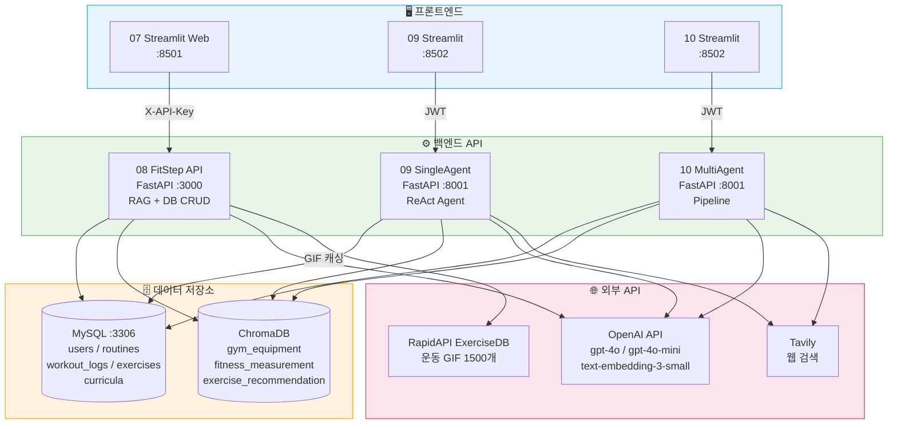
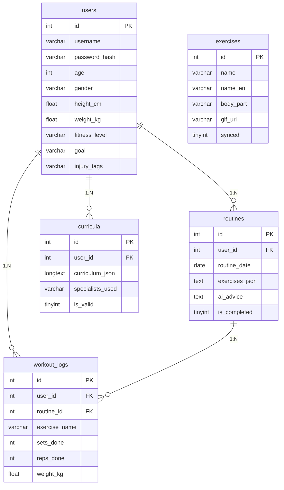
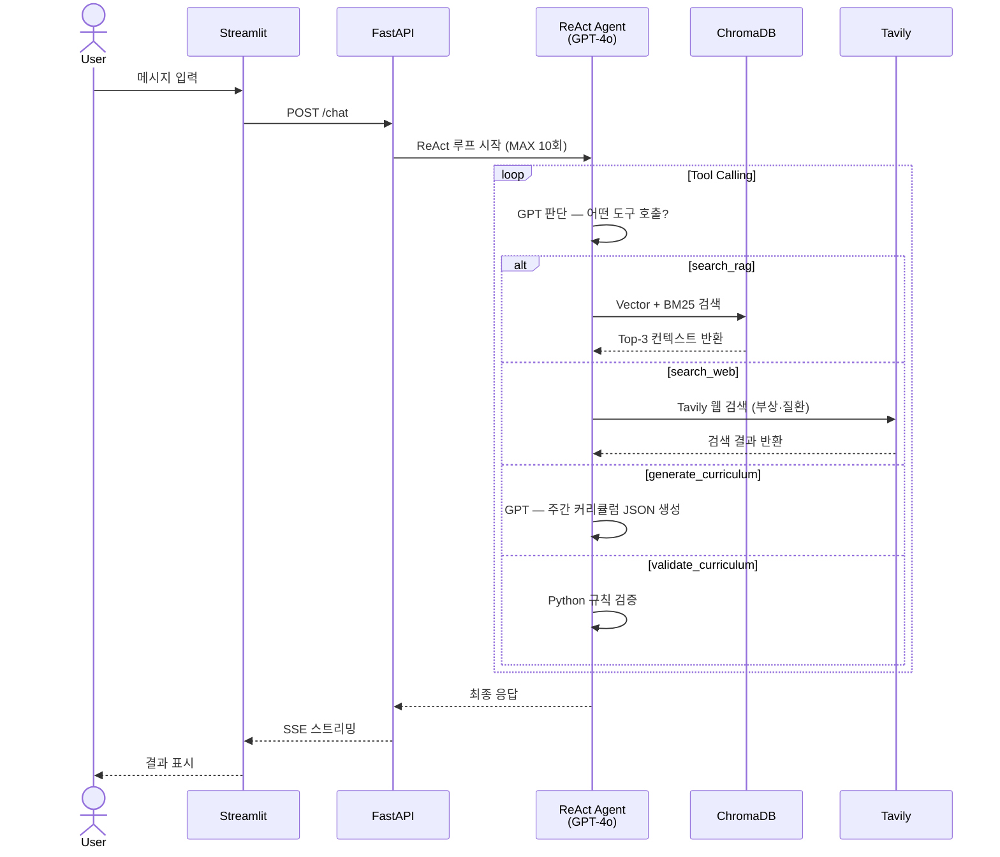
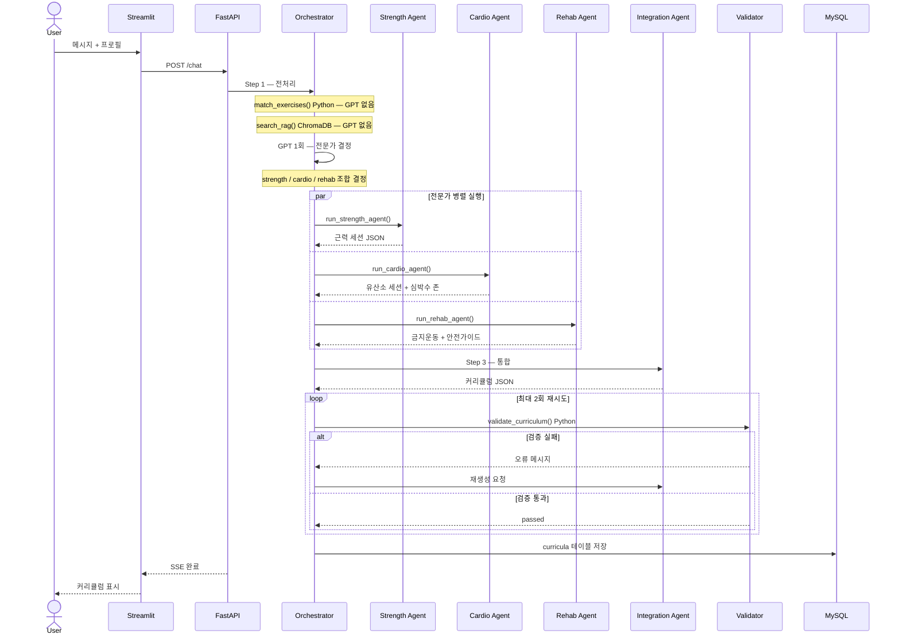
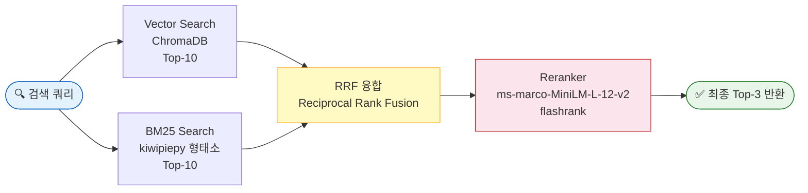
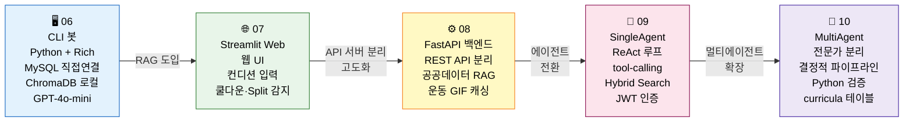

# FitStep 프로젝트 설명서

## 목차
1. [문제 정의](#1-문제-정의)
2. [해결 방향](#2-해결-방향)
3. [트레이드오프 및 설계 결정](#3-트레이드오프-및-설계-결정)
4. [시스템 아키텍처](#4-시스템-아키텍처)
5. [에이전트 파이프라인](#5-에이전트-파이프라인)
6. [프로젝트 진화 경로](#6-프로젝트-진화-경로)
7. [기술 스택](#7-기술-스택)
8. [실행 방법](#8-실행-방법)

---

## 1. 문제 정의

### 기존 헬스 앱의 한계

일반적인 운동 앱은 **정해진 템플릿 루틴**을 제공한다. 사용자의 헬스장 기구 환경, 오늘의 컨디션, 부상 이력, 점진적 향상 상태를 반영하지 못한다.

| 기존 앱의 문제 | 구체적 상황 |
|---|---|
| 기구 미반영 | 스미스 머신이 없는 헬스장인데 스미스 머신 루틴 추천 |
| 컨디션 미반영 | 전날 과훈련 후에도 동일 강도 루틴 제공 |
| 부상 무시 | 무릎 부상이 있는데 스쿼트 고중량 추천 |
| 점진적 과부하 없음 | 3개월째 같은 무게·횟수 반복 |
| 근육 회복 무시 | 어제 가슴 운동 후 오늘도 가슴 운동 추천 |

### 핵심 질문

> "사용자의 헬스장 환경, 신체 상태, 운동 이력을 모두 반영하여 매일 다른 맞춤 루틴을 자동으로 생성할 수 있는가?"

---

## 2. 해결 방향

### 3가지 핵심 접근

**① RAG 기반 개인화**
- 사용자 헬스장 기구 정보를 ChromaDB에 벡터로 저장
- 루틴 생성 시 해당 사용자의 기구만 검색·주입 → GPT가 보유 기구로만 루틴 구성

**② 공공데이터 근거 기반 추천**
- 국민체육공단 체력측정 데이터(950건) + 운동추천 데이터를 RAG로 활용
- 연령대·BMI·성별이 유사한 실제 사례를 GPT 컨텍스트에 주입

**③ 운동 이력 기반 동적 조정**
- 쿨다운 추적: 운동별 마지막 수행일 → 회복 기간(2~3일) 자동 계산
- Progressive Overload: 세트/횟수/무게 기록 분석 → 다음 목표 자동 제안
- Split 감지: 최근 2일 훈련 부위 분석 → 오늘 제외 부위 자동 결정

---

## 3. 트레이드오프 및 설계 결정

### 결정 1 — ChromaDB vs 관계형 DB (헬스장 기구 저장)

| | ChromaDB (선택) | MySQL |
|---|---|---|
| 장점 | 자연어 유사도 검색, 프롬프트 주입 편의 | 정형 쿼리, 트랜잭션 |
| 단점 | 정형 필터 약함 | 임베딩 검색 불가 |
| **결정 이유** | 기구 정보를 자연어로 GPT에 주입하는 용도이므로 벡터DB가 적합 |

> 단, 현재 헬스장 기구 조회는 `collection.get(where={"user_id": ...})`로 전체 조회 방식. 진정한 유사도 검색은 향후 개선 예정.

### 결정 2 — 단일 GPT 호출 vs 멀티에이전트

| | 단일 호출 (06~08) | 멀티에이전트 (10) |
|---|---|---|
| 속도 | 빠름 (1회 호출) | 느림 (4~5회 호출) |
| 비용 | 낮음 | 높음 |
| 전문성 | 범용 답변 | 근력/유산소/재활 분리 |
| 검증 | 없음 | Python 규칙 검증 후 재시도 |
| **적합 상황** | 일상적 루틴 추천 | 부상·특수 조건·주간 커리큘럼 |

### 결정 3 — JWT vs API Key 인증

- **08_FitStep_API**: X-API-Key 헤더 방식 → 단순, Streamlit 연동 편의
- **09/10**: JWT Bearer 토큰 → 에이전트 서버는 사용자별 세션 관리 필요

### 결정 4 — GPT 역할 최소화 원칙

> "신뢰가 필요한 작업(필터링·검증·계산)은 코드가, 자연어 생성만 GPT가 담당"

- 기구 매핑: Python 딕셔너리 (GPT 없음)
- 커리큘럼 검증: Python 규칙 (GPT 없음)
- 쿨다운 계산: Python datetime (GPT 없음)
- 루틴 생성·에이전트 판단: GPT 담당

---

## 4. 시스템 아키텍처

### 전체 서비스 구조



### 데이터베이스 스키마



---

## 5. 에이전트 파이프라인

### 09 SingleAgent — ReAct 루프



### 10 MultiAgent — 결정적 파이프라인



### Hybrid Search 파이프라인 (09/10 공통)



---

## 6. 프로젝트 진화 경로



### 단계별 핵심 변화

| 버전 | 구조 | GPT 호출 | 인증 | 주요 추가 기능 |
|---|---|---|---|---|
| 06 CLI | 단일 Python 앱 | 1회 | 없음 | 헬스장 RAG, Progressive Overload |
| 07 Web | Streamlit + API 분리 | 1회 | API Key | 컨디션 입력, 쿨다운 순환, GIF |
| 08 API | FastAPI 서버 | 1회 | API Key | 공공데이터 RAG, DB CRUD REST화 |
| 09 Agent | ReAct 단일 에이전트 | 최대 10회 | JWT | tool-calling, 웹 검색, Hybrid Search |
| 10 Multi | 전문가 멀티에이전트 | 4~5회 고정 | JWT | 역할 분리, 검증 재시도, 주간 커리큘럼 |

---

## 7. 기술 스택

| 계층 | 기술 | 용도 |
|---|---|---|
| **UI** | Streamlit, Plotly | 웹 인터페이스, 차트 |
| **CLI** | Python, Rich | 터미널 앱 |
| **API 서버** | FastAPI, uvicorn | REST API |
| **AI 모델** | GPT-4o-mini, GPT-4o | 루틴·커리큘럼 생성, 에이전트 판단 |
| **임베딩** | text-embedding-3-small | ChromaDB 벡터 저장 |
| **RAG** | LangChain, ChromaDB 1.5.8 | 헬스장 기구·공공데이터 검색 |
| **Hybrid Search** | BM25 (kiwipiepy), RRF, flashrank | 09/10 고품질 검색 |
| **관계형 DB** | MySQL 8.0 | 사용자·루틴·로그 저장 |
| **인증** | SHA-256 (08), JWT (09/10) | API 보안 |
| **외부 API** | RapidAPI ExerciseDB, Tavily | 운동 GIF, 웹 검색 |
| **배포** | Docker Compose, Streamlit Cloud, ngrok | 컨테이너화·클라우드 배포 |

---

## 8. 실행 방법

### 사전 준비

```bash
# 공통 환경변수 (.env)
OPENAI_API_KEY=sk-proj-...
DB_HOST=localhost
DB_PORT=3306
DB_USER=root
DB_PASSWORD=<password>
DB_NAME=fitstep
```

### 06 CLI 봇

```bash
cd 06_FitStep
python -m venv venv && source venv/bin/activate
pip install -r requirements.txt
python seed_gym.py   # 헬스장 데이터 초기 적재 (선택)
python main.py
```

### 08 API 서버 + 07 웹 (Docker)

```bash
cd 08_FitStep_API
# .env에 OPENAI_API_KEY, MYSQL_ROOT_PASSWORD, RAG_API_KEY 설정
docker compose up -d --build

# 공공데이터 초기 인덱싱 (최초 1회)
python init_public_data.py

# 헬스체크
curl http://localhost:3000/health
```

```bash
# 07 웹 로컬 실행
cd 07_FitStep_Web
# .env에 RAG_API_URL=http://localhost:3000, RAG_API_KEY 설정
pip install -r requirements.txt
streamlit run app.py
# → http://localhost:8501
```

### 09 SingleAgent

```bash
cd 09_SingleAgent
# 08 먼저 실행 (MySQL/ChromaDB 공유)
cp .env.example .env   # JWT_SECRET_KEY, TAVILY_API_KEY 추가
docker compose up -d
# API: http://localhost:8001
# Streamlit: http://localhost:8502
```

### 10 MultiAgent

```bash
cd 10_MultiAgent
cp .env.example .env
docker compose up -d
# API: http://localhost:8001
# Streamlit: http://localhost:8502
```

### Streamlit Cloud 배포 (07 웹)

```bash
# 1. 로컬에서 ngrok 터널 실행
ngrok http 3000

# 2. Streamlit Cloud secrets.toml 설정
RAG_API_URL = "https://ngrok-uuid.ngrok.io"
RAG_API_KEY = "<api_key>"
OPENAI_API_KEY = "sk-proj-..."
```

### 포트 요약

| 서비스 | 포트 |
|---|---|
| MySQL | 3306 (로컬) / 3307 (Docker) |
| 08 FastAPI | 3000 |
| 07 Streamlit | 8501 |
| 09 FastAPI | 8001 |
| 09 Streamlit | 8502 |
| 10 FastAPI | 8001 |
| 10 Streamlit | 8502 |
